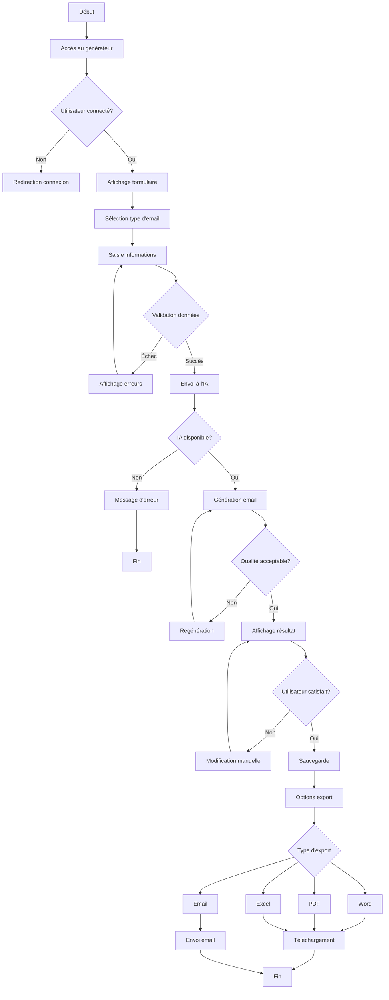
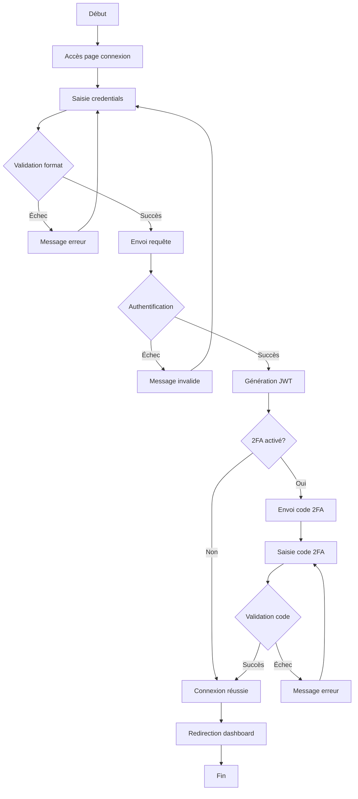
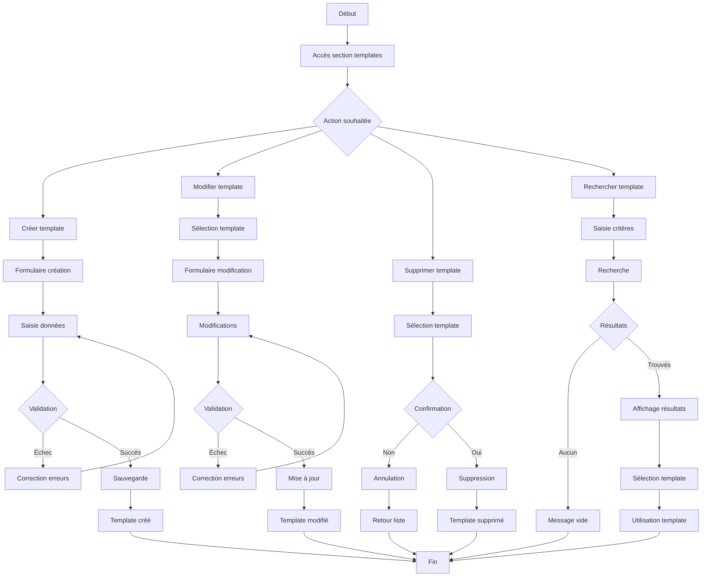
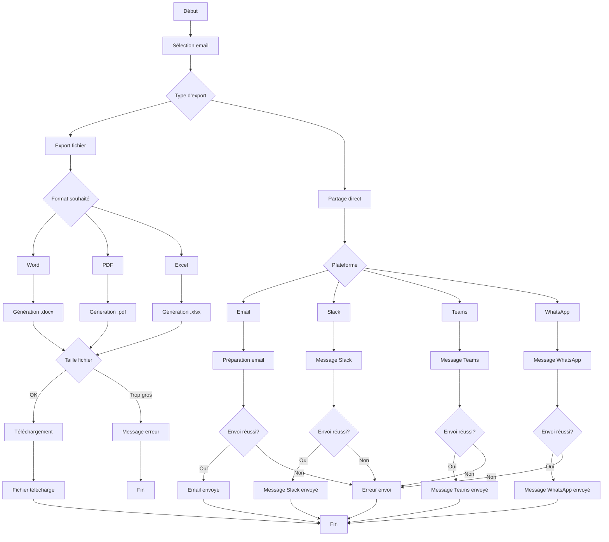
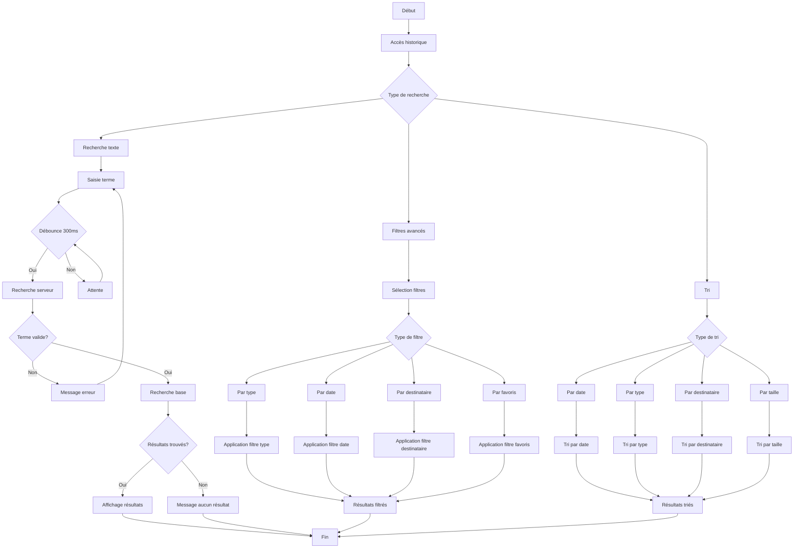
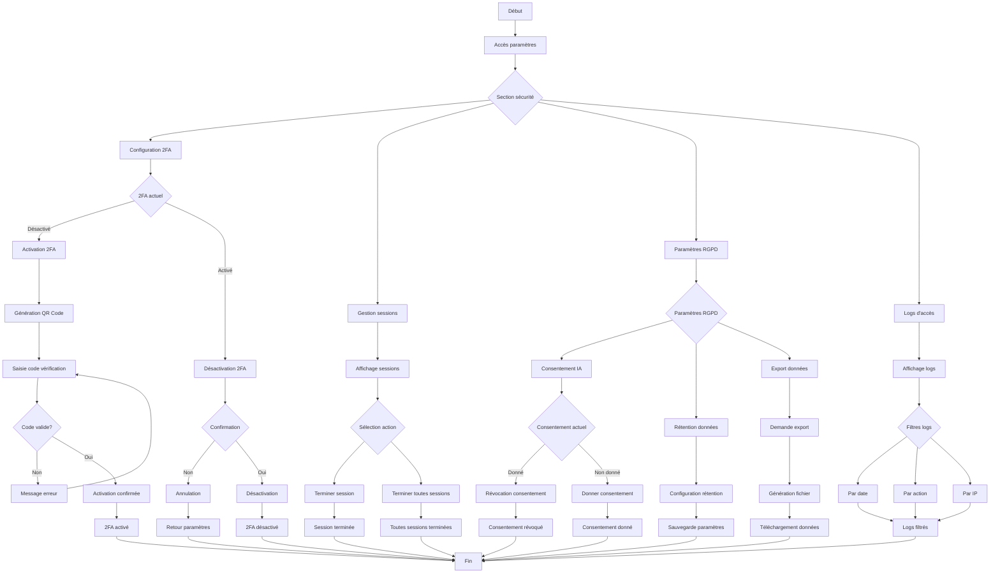
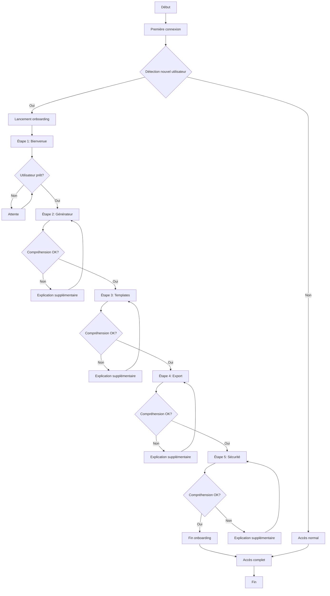
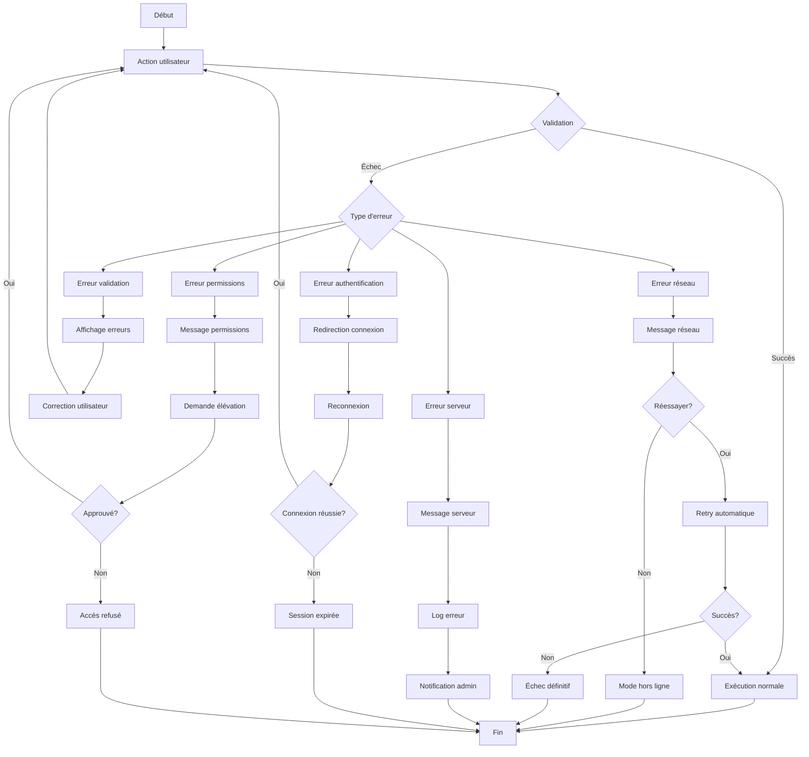
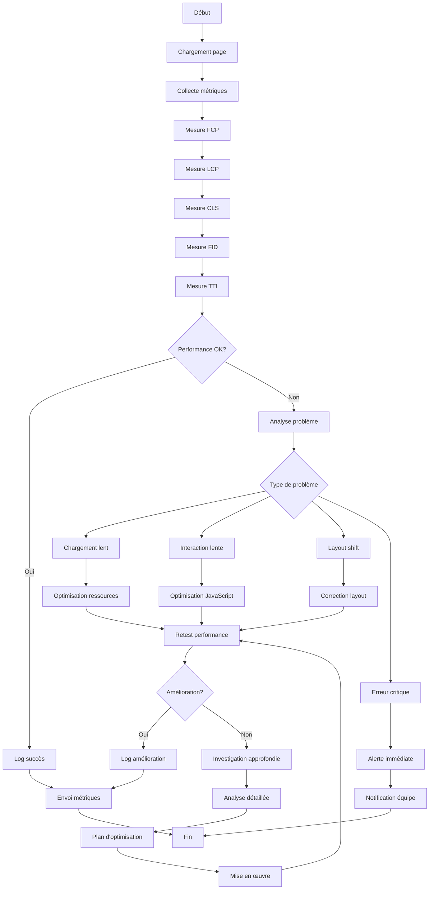
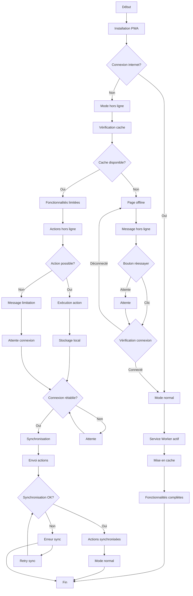

# Diagramme d'Activités - ProMail Assistant

## 1. Activité Principale - Génération d'Email

## 2. Activité - Processus d'Authentification

## 3. Activité - Gestion des Templates

## 4. Activité - Export et Partage

## 5. Activité - Recherche et Filtrage

## 6. Activité - Configuration Sécurité

## 7. Activité - Onboarding Utilisateur

## 8. Activité - Gestion des Erreurs

## 9. Activité - Performance Monitoring

## 10. Activité - PWA et Synchronisation

