# Diagramme d'Architecture - ProMail Assistant

## 1. Architecture Générale

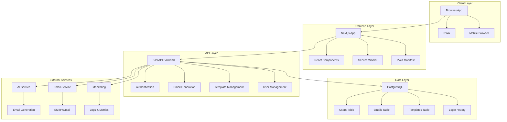

## 2. Flux de Données

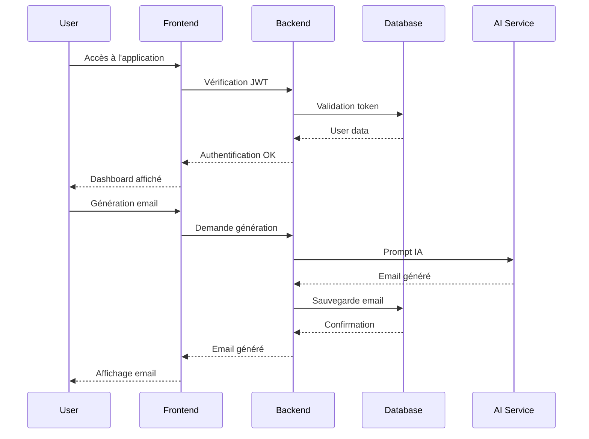

## 3. Architecture des Composants

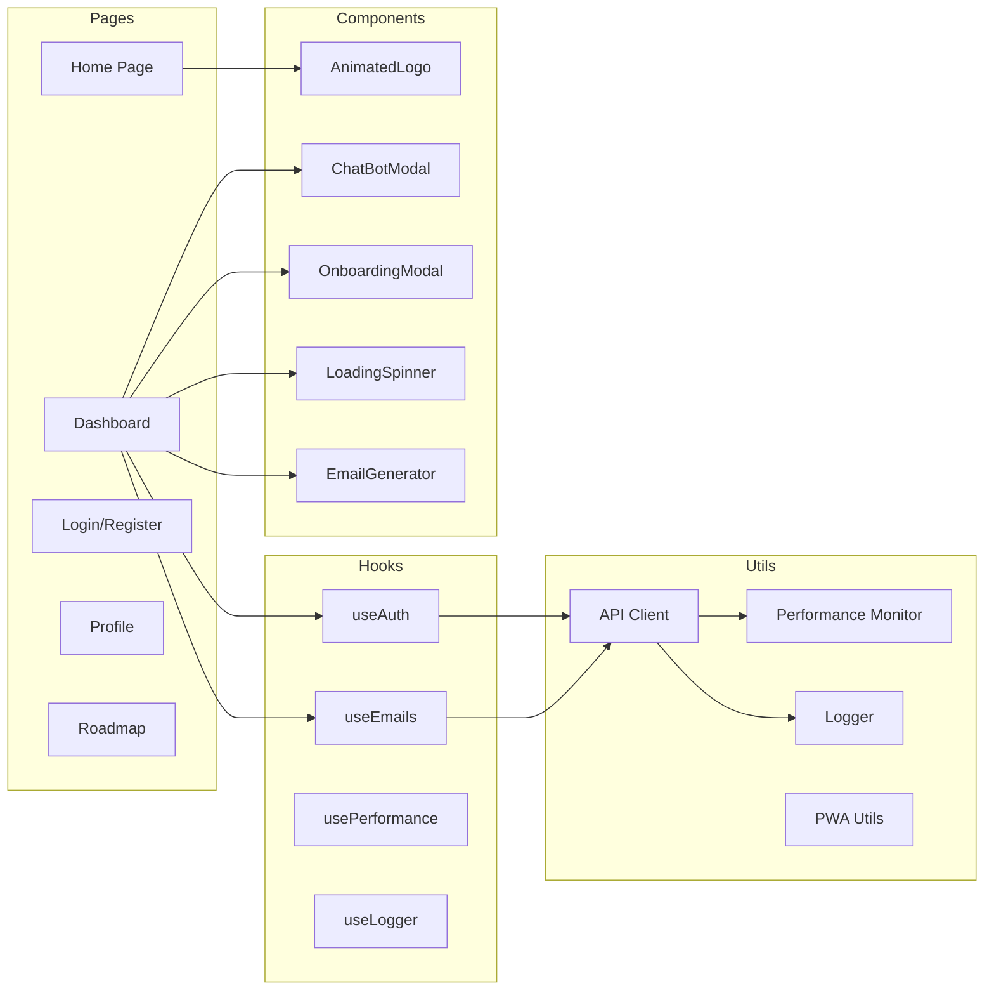

## 4. Modèle de Données

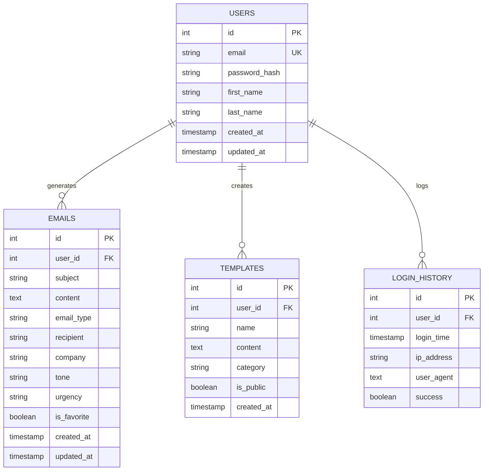

## 5. Flux d'Authentification

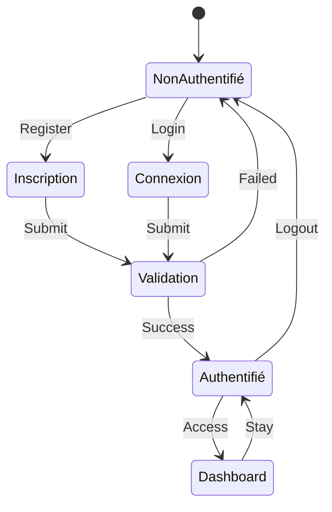

## 6. Workflow de Génération d'Email

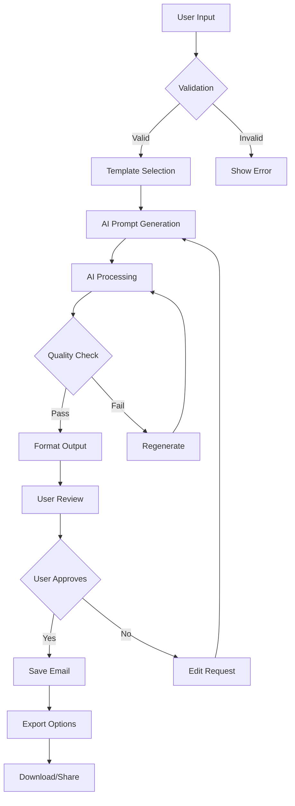

## 7. Architecture PWA

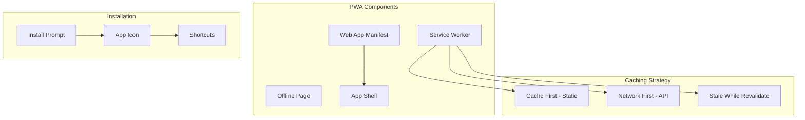

## 8. Monitoring et Logging

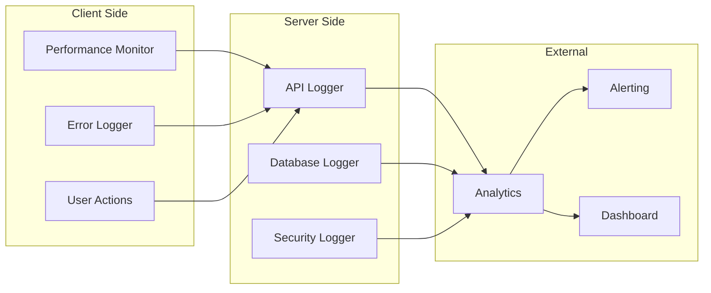

## 9. Déploiement et Infrastructure

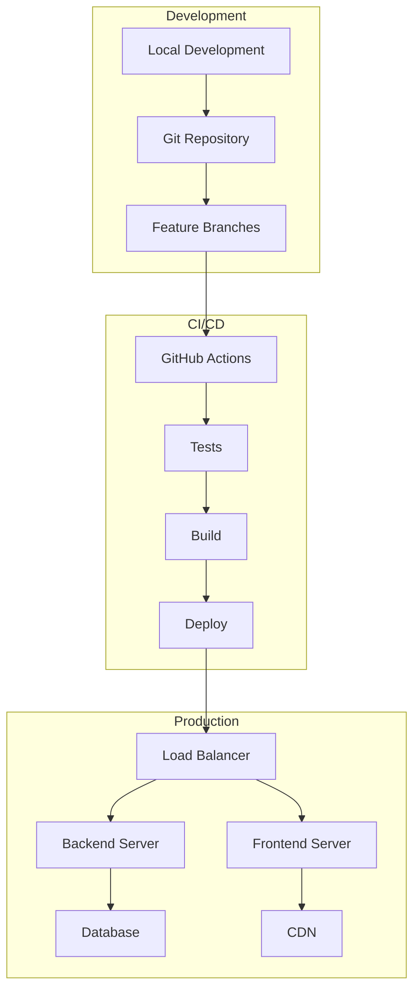

## 10. Sécurité et Permissions

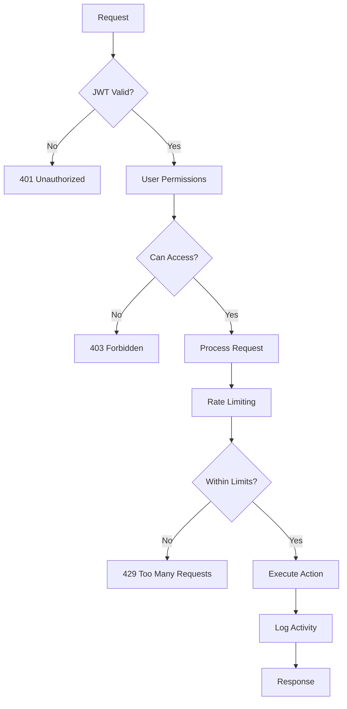

## 11. Performance Monitoring

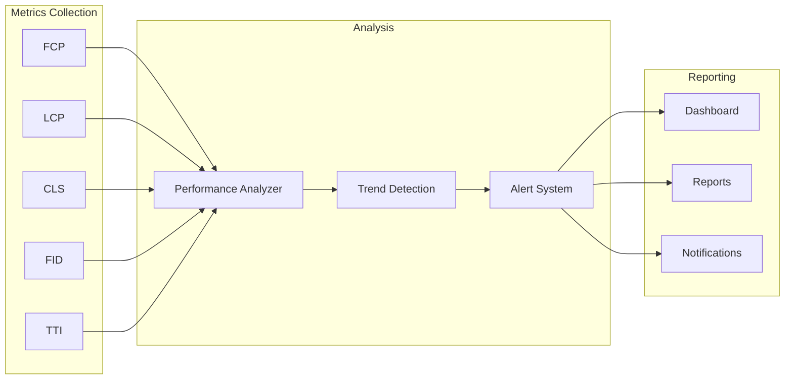

## 12. Tests et Qualité

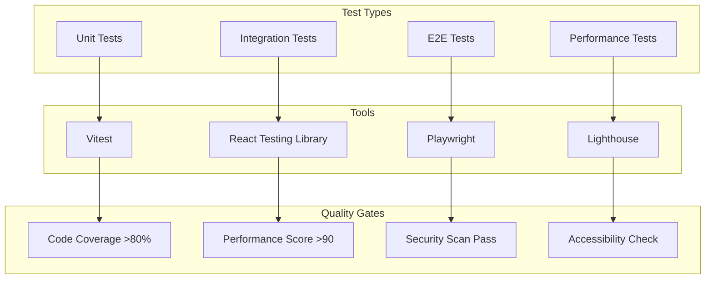