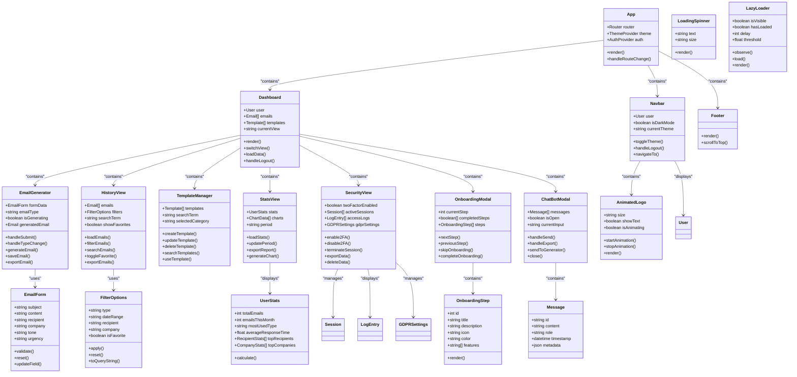
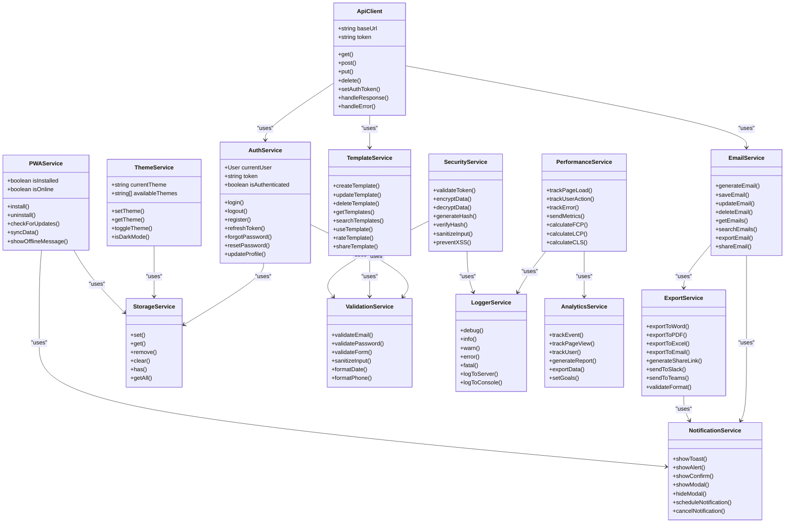
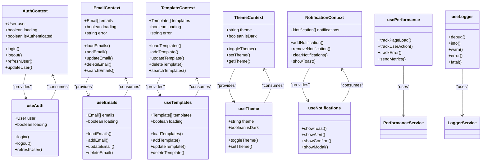

# Diagramme de Classe - ProMail Assistant

## 1. Diagramme de Classe Principal

```mermaid
classDiagram
    class User {
        +int id
        +string email
        +string password_hash
        +string first_name
        +string last_name
        +datetime created_at
        +datetime updated_at
        +boolean is_active
        +boolean email_verified
        +string two_factor_secret
        +boolean two_factor_enabled
        +login()
        +logout()
        +updateProfile()
        +changePassword()
        +enable2FA()
        +disable2FA()
    }
    
    class Email {
        +int id
        +int user_id
        +string subject
        +text content
        +string email_type
        +string recipient
        +string company
        +string tone
        +string urgency
        +boolean is_favorite
        +json metadata
        +datetime created_at
        +datetime updated_at
        +datetime sent_at
        +string status
        +generate()
        +save()
        +update()
        +delete()
        +export()
        +share()
    }
    
    class Template {
        +int id
        +int user_id
        +string name
        +text content
        +string category
        +boolean is_public
        +json metadata
        +datetime created_at
        +datetime updated_at
        +int usage_count
        +float rating
        +create()
        +update()
        +delete()
        +use()
        +rate()
        +share()
    }
    
    class LoginHistory {
        +int id
        +int user_id
        +datetime login_time
        +string ip_address
        +text user_agent
        +boolean success
        +string failure_reason
        +string location
        +string device_type
        +log()
        +getUserLogs()
        +cleanupOldLogs()
    }
    
    class UserPreferences {
        +int id
        +int user_id
        +json settings
        +string language
        +string timezone
        +boolean email_notifications
        +boolean push_notifications
        +datetime updated_at
        +updateSettings()
        +getSettings()
        +resetToDefault()
    }
    
    class EmailAnalytics {
        +int id
        +int email_id
        +int user_id
        +string action
        +datetime action_time
        +json metadata
        +string session_id
        +track()
        +getUserAnalytics()
        +getEmailAnalytics()
        +generateReport()
    }
    
    class ApiKey {
        +int id
        +int user_id
        +string key_hash
        +string name
        +boolean is_active
        +datetime created_at
        +datetime last_used
        +datetime expires_at
        +generate()
        +validate()
        +revoke()
        +updateLastUsed()
    }
    
    class SecurityManager {
        +validateToken()
        +generateJWT()
        +hashPassword()
        +verifyPassword()
        +generate2FASecret()
        +verify2FACode()
        +logAccess()
        +checkPermissions()
    }
    
    class EmailGenerator {
        +generateEmail()
        +validateInput()
        +createPrompt()
        +processAIResponse()
        +formatEmail()
        +saveToDatabase()
    }
    
    class ExportService {
        +exportToWord()
        +exportToPDF()
        +exportToExcel()
        +exportToEmail()
        +generateShareLink()
        +sendToSlack()
        +sendToTeams()
    }
    
    class NotificationService {
        +sendEmail()
        +sendPushNotification()
        +sendSMS()
        +scheduleNotification()
        +cancelNotification()
    }
    
    class AnalyticsService {
        +trackEvent()
        +generateReport()
        +calculateMetrics()
        +exportData()
        +setAlerts()
    }
    
    class CacheManager {
        +get()
        +set()
        +delete()
        +clear()
        +isExpired()
        +refresh()
    }
    
    class Logger {
        +debug()
        +info()
        +warn()
        +error()
        +fatal()
        +logToDatabase()
        +sendToExternal()
    }
    
    User ||--o{ Email : "generates"
    User ||--o{ Template : "creates"
    User ||--o{ LoginHistory : "logs"
    User ||--|| UserPreferences : "has"
    User ||--o{ ApiKey : "owns"
    User ||--o{ EmailAnalytics : "tracks"
    
    Email ||--o{ EmailAnalytics : "analyzed"
    
    SecurityManager --> User : "manages"
    EmailGenerator --> Email : "creates"
    ExportService --> Email : "exports"
    NotificationService --> User : "notifies"
    AnalyticsService --> EmailAnalytics : "processes"
    CacheManager --> User : "caches"
    Logger --> LoginHistory : "logs"
```

## 2. Diagramme de Classe - Frontend Components



## 3. Diagramme de Classe - Services et Utils



## 4. Diagramme de Classe - Hooks et Context

