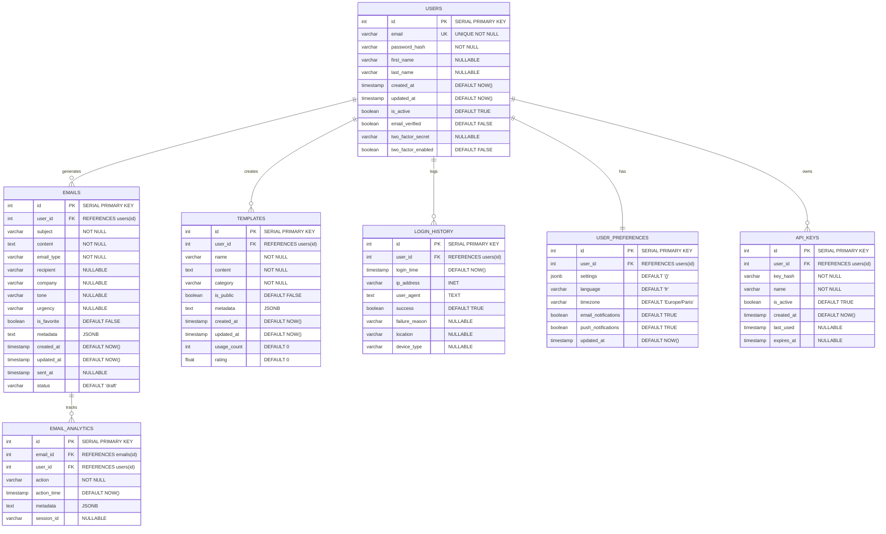

# Diagrammes de Base de Données - ProMail Assistant

## 1. Schéma de Base de Données Principal



## 2. Index et Contraintes

```sql
-- Index pour optimiser les performances
CREATE INDEX idx_users_email ON users(email);
CREATE INDEX idx_users_created_at ON users(created_at);
CREATE INDEX idx_emails_user_id ON emails(user_id);
CREATE INDEX idx_emails_created_at ON emails(created_at);
CREATE INDEX idx_emails_type ON emails(email_type);
CREATE INDEX idx_emails_favorite ON emails(is_favorite) WHERE is_favorite = true;
CREATE INDEX idx_templates_user_id ON templates(user_id);
CREATE INDEX idx_templates_category ON templates(category);
CREATE INDEX idx_templates_public ON templates(is_public) WHERE is_public = true;
CREATE INDEX idx_login_history_user_id ON login_history(user_id);
CREATE INDEX idx_login_history_time ON login_history(login_time);

-- Index pour les recherches full-text
CREATE INDEX idx_emails_content_fts ON emails USING gin(to_tsvector('french', content));
CREATE INDEX idx_templates_content_fts ON templates USING gin(to_tsvector('french', content));

-- Contraintes de validation
ALTER TABLE users ADD CONSTRAINT chk_email_format CHECK (email ~* '^[A-Za-z0-9._%+-]+@[A-Za-z0-9.-]+\.[A-Za-z]{2,}$');
ALTER TABLE emails ADD CONSTRAINT chk_email_type CHECK (email_type IN ('commercial', 'relance', 'rendez_vous', 'reclamation', 'remerciement', 'information'));
ALTER TABLE emails ADD CONSTRAINT chk_tone CHECK (tone IN ('formel', 'informel', 'amical', 'professionnel'));
ALTER TABLE emails ADD CONSTRAINT chk_urgency CHECK (urgency IN ('faible', 'normale', 'elevee', 'urgente'));
ALTER TABLE templates ADD CONSTRAINT chk_category CHECK (category IN ('commercial', 'rh', 'client', 'fournisseur', 'general'));
```

## 3. Vues pour les Rapports

```sql
-- Vue pour les statistiques utilisateur
CREATE VIEW user_stats AS
SELECT 
    u.id,
    u.email,
    u.first_name,
    u.last_name,
    COUNT(e.id) as total_emails,
    COUNT(CASE WHEN e.is_favorite = true THEN 1 END) as favorite_emails,
    COUNT(t.id) as total_templates,
    MAX(e.created_at) as last_email_date,
    MAX(lh.login_time) as last_login
FROM users u
LEFT JOIN emails e ON u.id = e.user_id
LEFT JOIN templates t ON u.id = t.user_id
LEFT JOIN login_history lh ON u.id = lh.user_id AND lh.success = true
GROUP BY u.id, u.email, u.first_name, u.last_name;

-- Vue pour les performances par type d'email
CREATE VIEW email_type_performance AS
SELECT 
    email_type,
    COUNT(*) as total_generated,
    AVG(LENGTH(content)) as avg_length,
    COUNT(CASE WHEN is_favorite = true THEN 1 END) as favorites,
    AVG(EXTRACT(EPOCH FROM (updated_at - created_at))) as avg_generation_time
FROM emails
GROUP BY email_type;

-- Vue pour l'activité utilisateur
CREATE VIEW user_activity AS
SELECT 
    u.id,
    u.email,
    COUNT(DISTINCT DATE(e.created_at)) as active_days,
    COUNT(e.id) as emails_generated,
    COUNT(lh.id) as login_count,
    MAX(lh.login_time) as last_activity
FROM users u
LEFT JOIN emails e ON u.id = e.user_id
LEFT JOIN login_history lh ON u.id = lh.user_id AND lh.success = true
GROUP BY u.id, u.email;
```

## 4. Fonctions et Triggers

```sql
-- Fonction pour mettre à jour updated_at automatiquement
CREATE OR REPLACE FUNCTION update_updated_at_column()
RETURNS TRIGGER AS $$
BEGIN
    NEW.updated_at = CURRENT_TIMESTAMP;
    RETURN NEW;
END;
$$ language 'plpgsql';

-- Triggers pour updated_at
CREATE TRIGGER update_users_updated_at BEFORE UPDATE ON users
    FOR EACH ROW EXECUTE FUNCTION update_updated_at_column();

CREATE TRIGGER update_emails_updated_at BEFORE UPDATE ON emails
    FOR EACH ROW EXECUTE FUNCTION update_updated_at_column();

CREATE TRIGGER update_templates_updated_at BEFORE UPDATE ON templates
    FOR EACH ROW EXECUTE FUNCTION update_updated_at_column();

-- Fonction pour nettoyer les anciens logs
CREATE OR REPLACE FUNCTION cleanup_old_logs()
RETURNS void AS $$
BEGIN
    DELETE FROM login_history 
    WHERE login_time < CURRENT_TIMESTAMP - INTERVAL '90 days';
    
    DELETE FROM email_analytics 
    WHERE action_time < CURRENT_TIMESTAMP - INTERVAL '30 days';
END;
$$ LANGUAGE plpgsql;

-- Fonction pour calculer les statistiques utilisateur
CREATE OR REPLACE FUNCTION get_user_statistics(user_id_param INTEGER)
RETURNS TABLE(
    total_emails BIGINT,
    favorite_emails BIGINT,
    total_templates BIGINT,
    avg_email_length NUMERIC,
    most_used_type VARCHAR,
    last_activity TIMESTAMP
) AS $$
BEGIN
    RETURN QUERY
    SELECT 
        COUNT(e.id)::BIGINT,
        COUNT(CASE WHEN e.is_favorite = true THEN 1 END)::BIGINT,
        COUNT(t.id)::BIGINT,
        AVG(LENGTH(e.content))::NUMERIC,
        (SELECT email_type FROM emails WHERE user_id = user_id_param 
         GROUP BY email_type ORDER BY COUNT(*) DESC LIMIT 1),
        MAX(lh.login_time)
    FROM users u
    LEFT JOIN emails e ON u.id = e.user_id
    LEFT JOIN templates t ON u.id = t.user_id
    LEFT JOIN login_history lh ON u.id = lh.user_id AND lh.success = true
    WHERE u.id = user_id_param
    GROUP BY u.id;
END;
$$ LANGUAGE plpgsql;
```

## 5. Partitioning pour les Grands Volumes

```sql
-- Partitioning pour login_history par mois
CREATE TABLE login_history_2024_01 PARTITION OF login_history
FOR VALUES FROM ('2024-01-01') TO ('2024-02-01');

CREATE TABLE login_history_2024_02 PARTITION OF login_history
FOR VALUES FROM ('2024-02-01') TO ('2024-03-01');

-- Partitioning pour email_analytics par semaine
CREATE TABLE email_analytics_2024_w01 PARTITION OF email_analytics
FOR VALUES FROM ('2024-01-01') TO ('2024-01-08');

CREATE TABLE email_analytics_2024_w02 PARTITION OF email_analytics
FOR VALUES FROM ('2024-01-08') TO ('2024-01-15');
```

## 6. Backup et Récupération

```sql
-- Script de backup automatique
-- À exécuter via cron ou pg_dump

-- Backup complet
pg_dump -h localhost -U promail_user -d promail_db -F c -f /backup/promail_$(date +%Y%m%d_%H%M%S).dump

-- Backup incrémental des données importantes
pg_dump -h localhost -U promail_user -d promail_db -t users -t emails -t templates -F c -f /backup/critical_$(date +%Y%m%d_%H%M%S).dump

-- Restauration
pg_restore -h localhost -U promail_user -d promail_db -c /backup/promail_20240101_120000.dump
```

## 7. Monitoring de la Base de Données

```sql
-- Requêtes de monitoring

-- Taille des tables
SELECT 
    schemaname,
    tablename,
    pg_size_pretty(pg_total_relation_size(schemaname||'.'||tablename)) as size
FROM pg_tables 
WHERE schemaname = 'public'
ORDER BY pg_total_relation_size(schemaname||'.'||tablename) DESC;

-- Performance des requêtes
SELECT 
    query,
    calls,
    total_time,
    mean_time,
    rows
FROM pg_stat_statements 
WHERE query LIKE '%emails%' OR query LIKE '%users%'
ORDER BY total_time DESC
LIMIT 10;

-- Connexions actives
SELECT 
    datname,
    usename,
    application_name,
    client_addr,
    state,
    query_start
FROM pg_stat_activity 
WHERE state = 'active';

-- Index non utilisés
SELECT 
    schemaname,
    tablename,
    indexname,
    idx_scan,
    idx_tup_read,
    idx_tup_fetch
FROM pg_stat_user_indexes 
WHERE idx_scan = 0
ORDER BY schemaname, tablename;
``` 