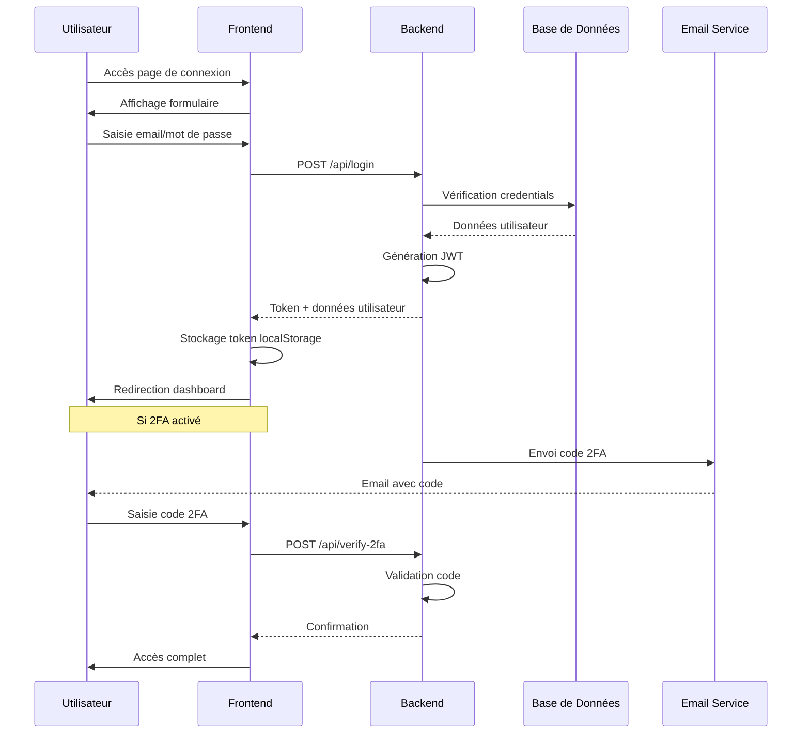
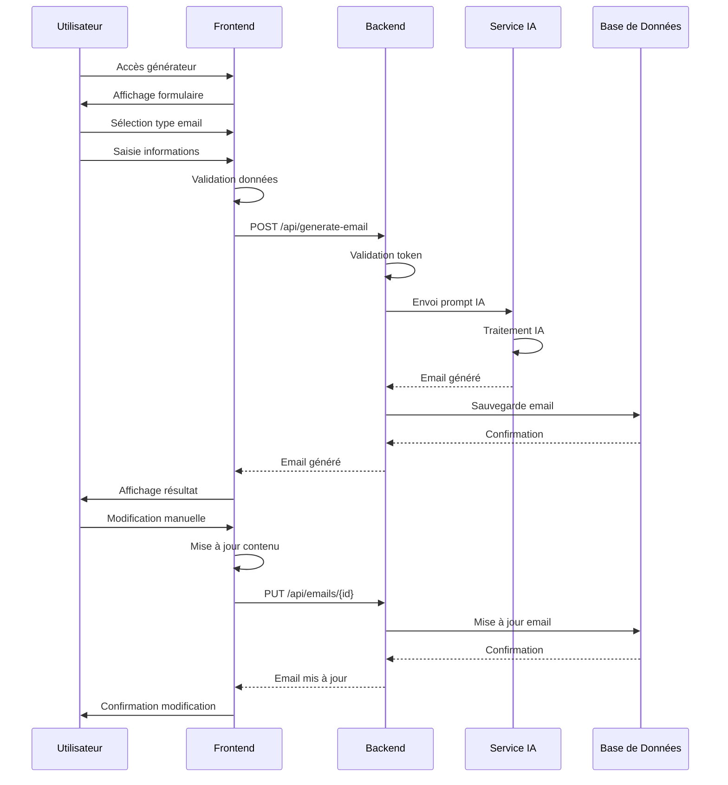
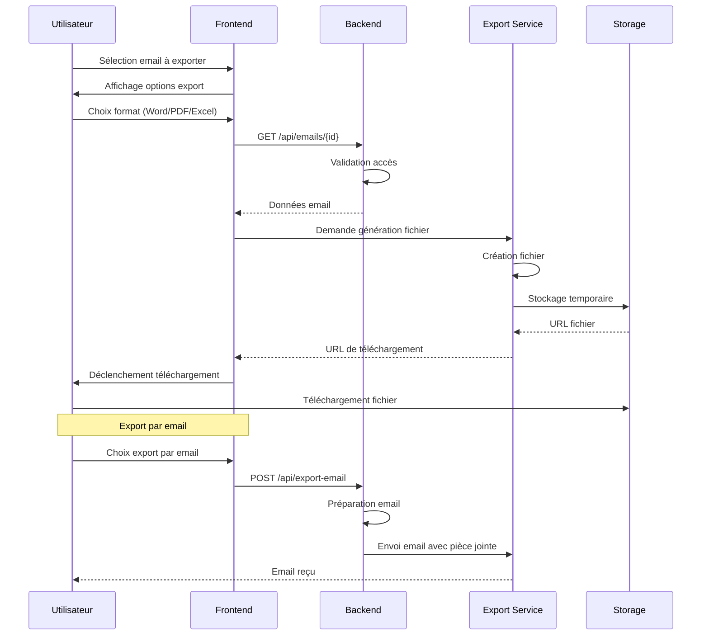
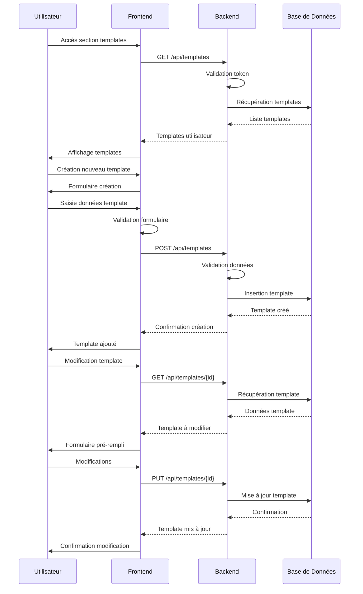
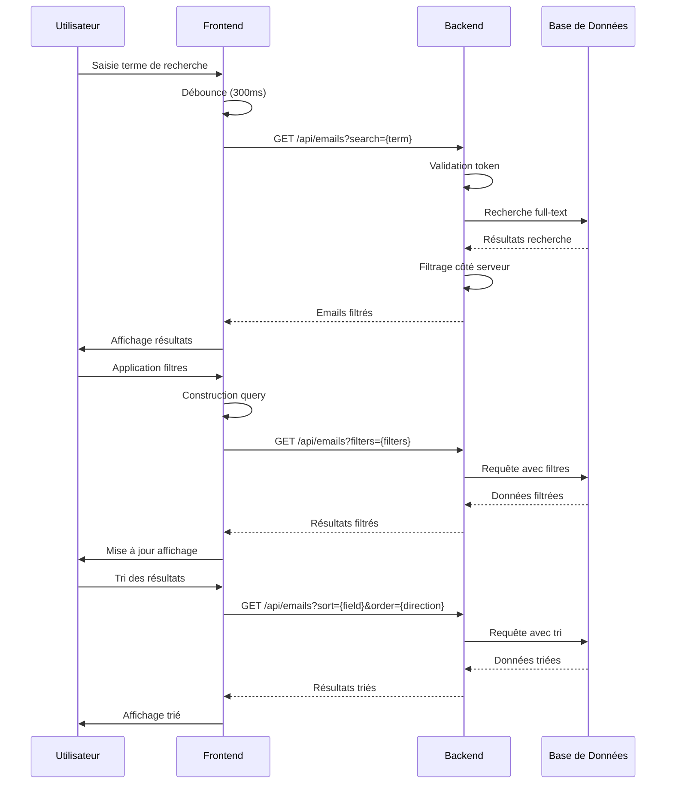
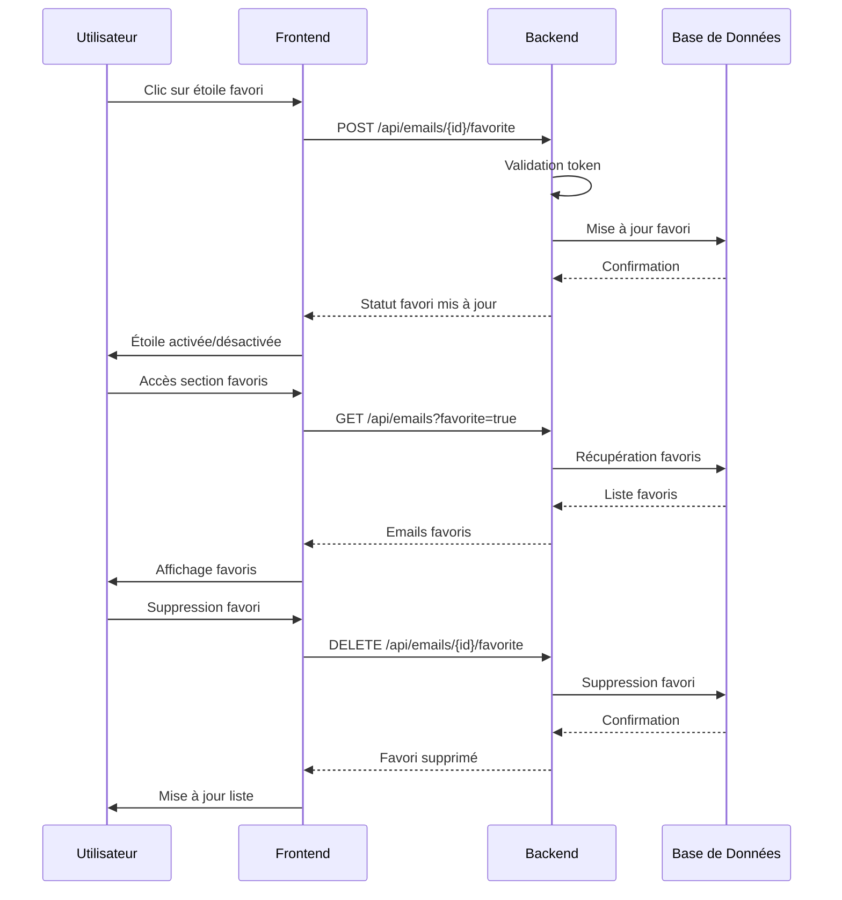
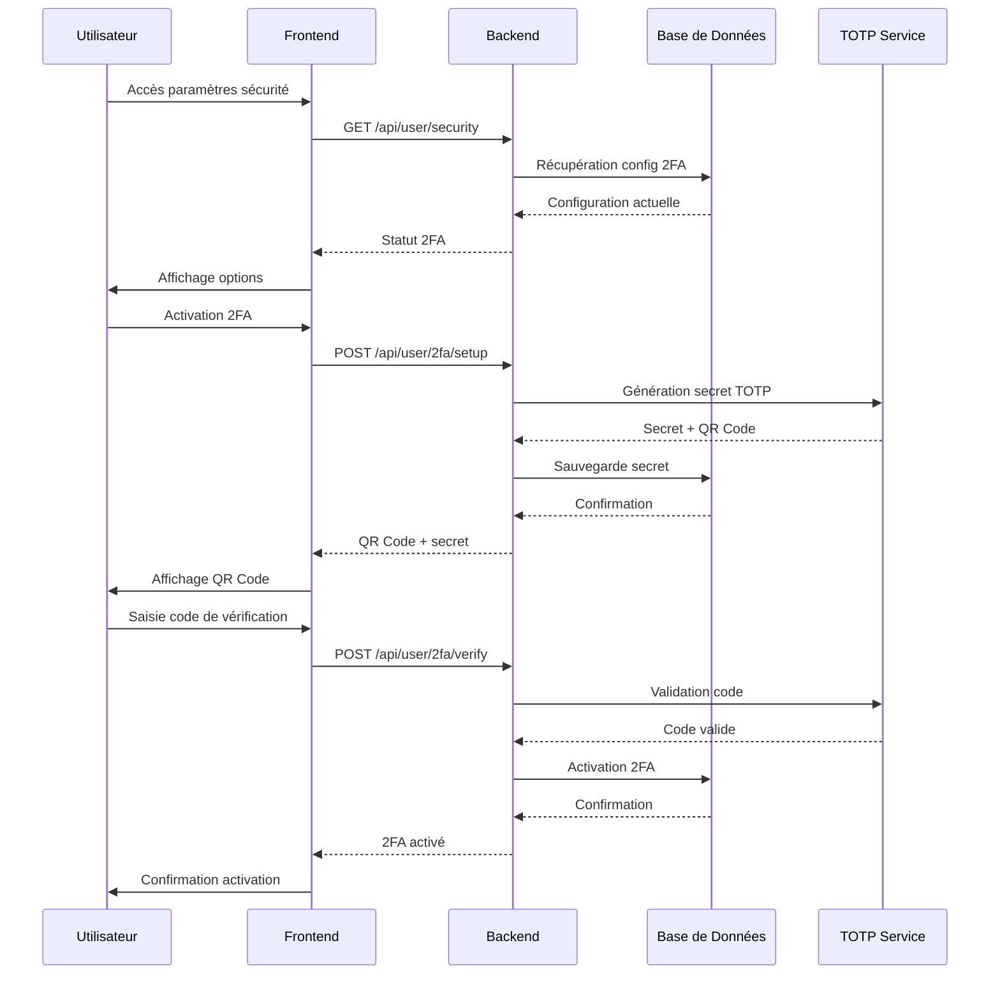
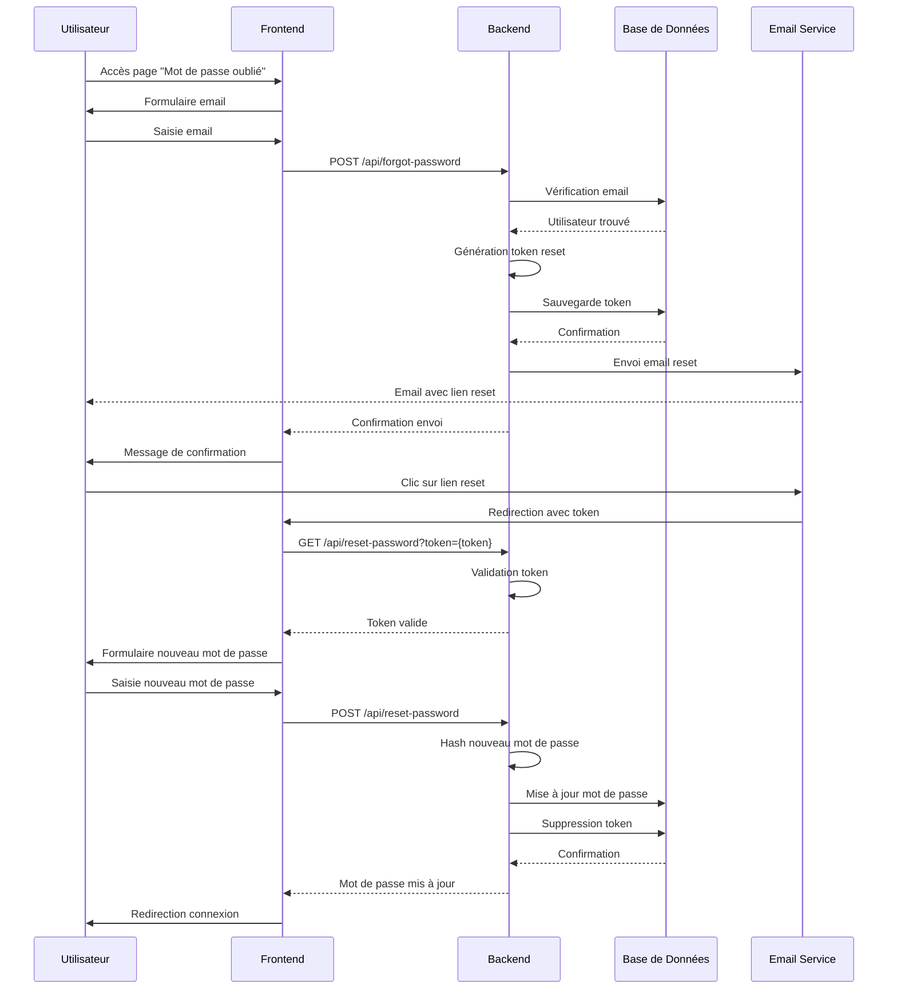
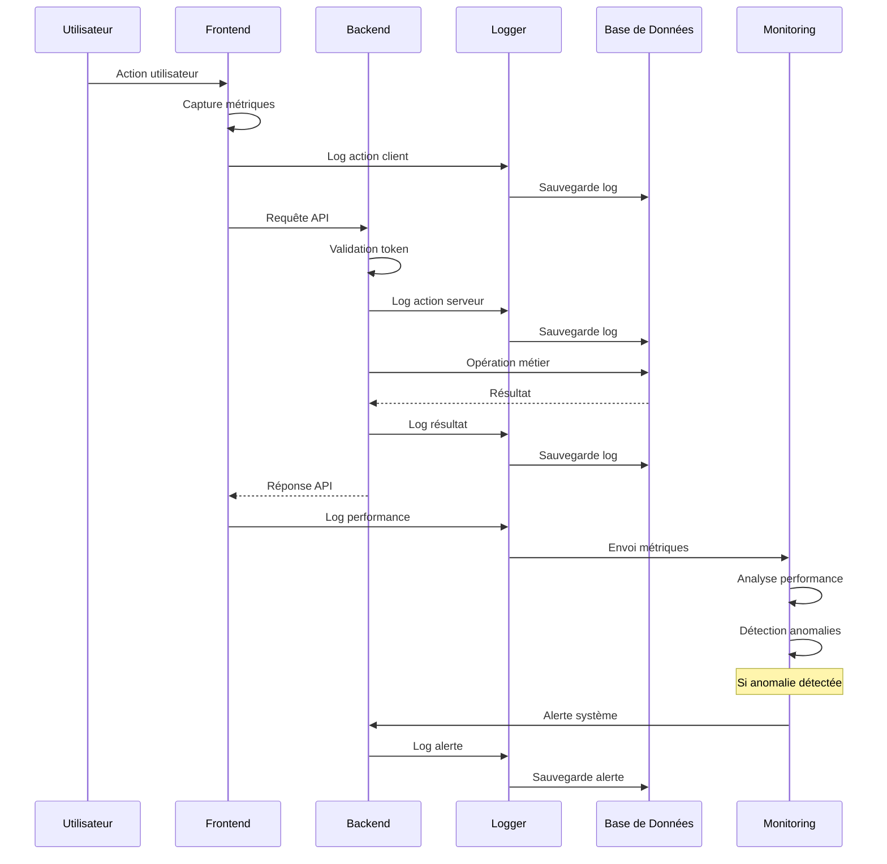
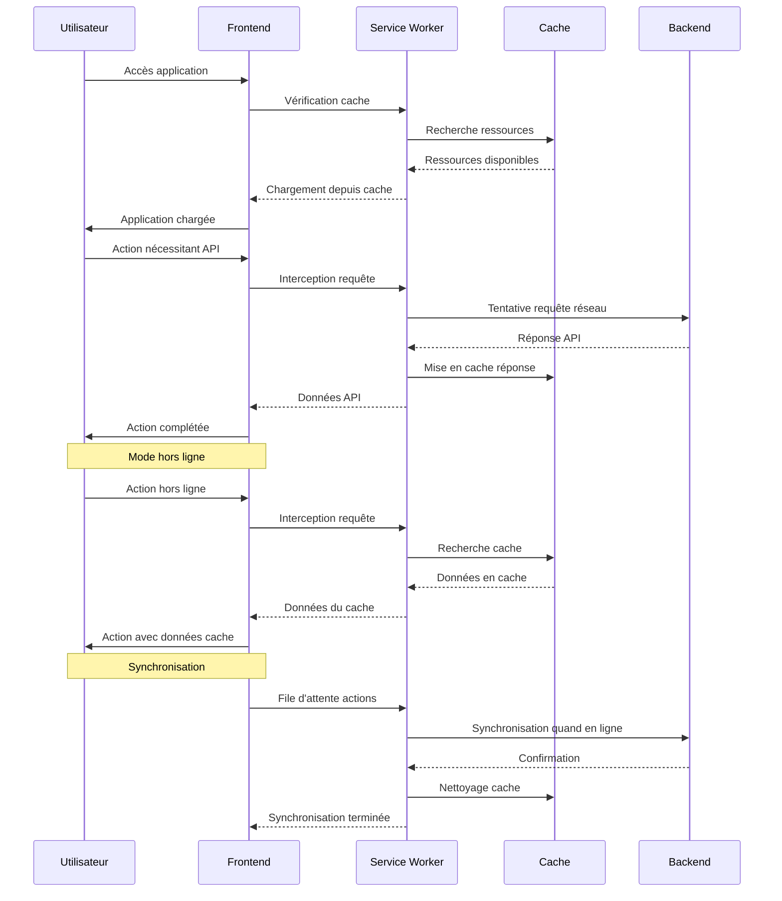

# Diagramme de Séquences - ProMail Assistant

## 1. Séquence d'Authentification

## 2. Séquence de Génération d'Email

## 3. Séquence d'Export d'Email

## 4. Séquence de Gestion des Templates

## 5. Séquence de Recherche et Filtrage

## 6. Séquence de Gestion des Favoris

## 7. Séquence de Configuration 2FA

## 8. Séquence de Réinitialisation de Mot de Passe

## 9. Séquence de Monitoring et Logs

## 10. Séquence PWA et Hors Ligne

