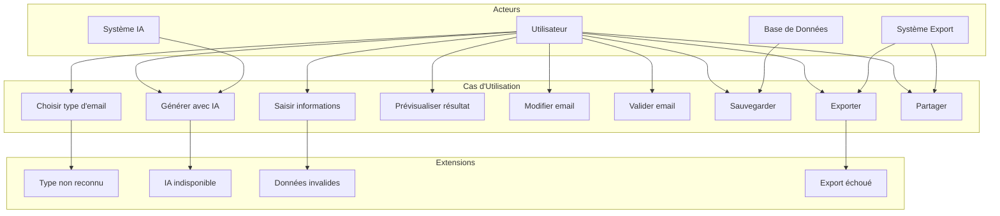
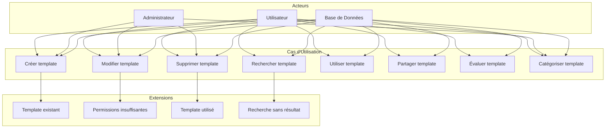
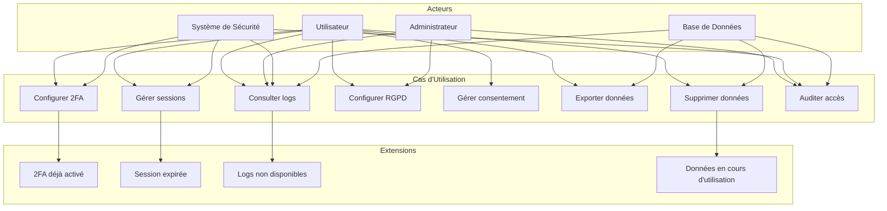
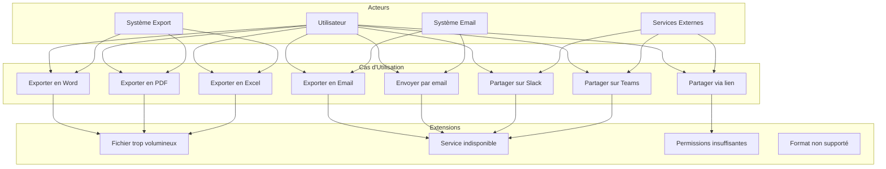
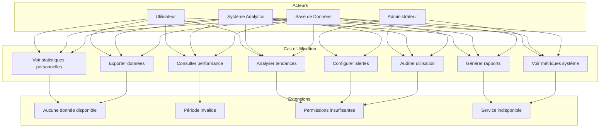

# Diagramme de Cas d'Utilisation - ProMail Assistant

## 1. Diagramme Principal des Cas d'Utilisation

```mermaid
graph TB
    subgraph "Acteurs"
        A[Utilisateur Non Authentifié]
        B[Utilisateur Authentifié]
        C[Administrateur]
        D[Système IA]
        E[Système Email]
    end
    
    subgraph "Cas d'Utilisation - Authentification"
        UC1[Se connecter]
        UC2[S'inscrire]
        UC3[Réinitialiser mot de passe]
        UC4[Activer 2FA]
        UC5[Gérer profil]
    end
    
    subgraph "Cas d'Utilisation - Génération Email"
        UC6[Générer email IA]
        UC7[Personnaliser email]
        UC8[Sauvegarder email]
        UC9[Exporter email]
        UC10[Partager email]
    end
    
    subgraph "Cas d'Utilisation - Gestion"
        UC11[Gérer templates]
        UC12[Consulter historique]
        UC13[Gérer favoris]
        UC14[Rechercher emails]
        UC15[Voir statistiques]
    end
    
    subgraph "Cas d'Utilisation - Sécurité"
        UC16[Gérer accès]
        UC17[Consulter logs]
        UC18[Configurer RGPD]
        UC19[Gérer consentement IA]
    end
    
    A --> UC1
    A --> UC2
    A --> UC3
    B --> UC4
    B --> UC5
    B --> UC6
    B --> UC7
    B --> UC8
    B --> UC9
    B --> UC10
    B --> UC11
    B --> UC12
    B --> UC13
    B --> UC14
    B --> UC15
    B --> UC16
    B --> UC17
    B --> UC18
    B --> UC19
    C --> UC17
    C --> UC18
    D --> UC6
    E --> UC9
    E --> UC10
```

## 2. Diagramme Détaillé - Génération d'Email

## 3. Diagramme - Gestion des Templates

## 4. Diagramme - Sécurité et RGPD

## 5. Diagramme - Export et Partage

## 6. Diagramme - Statistiques et Analytics

