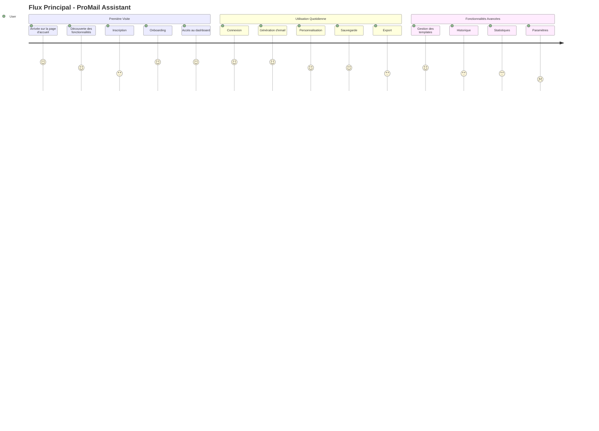
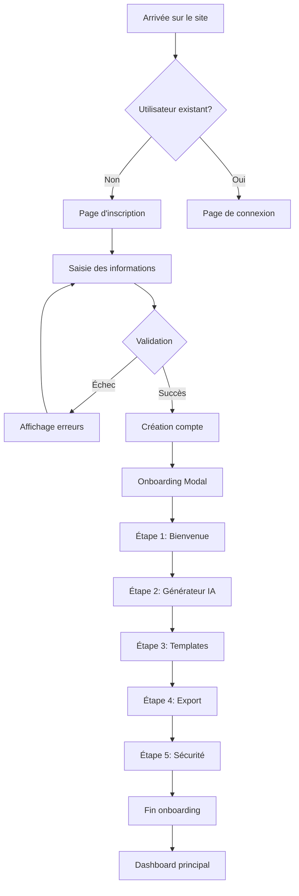
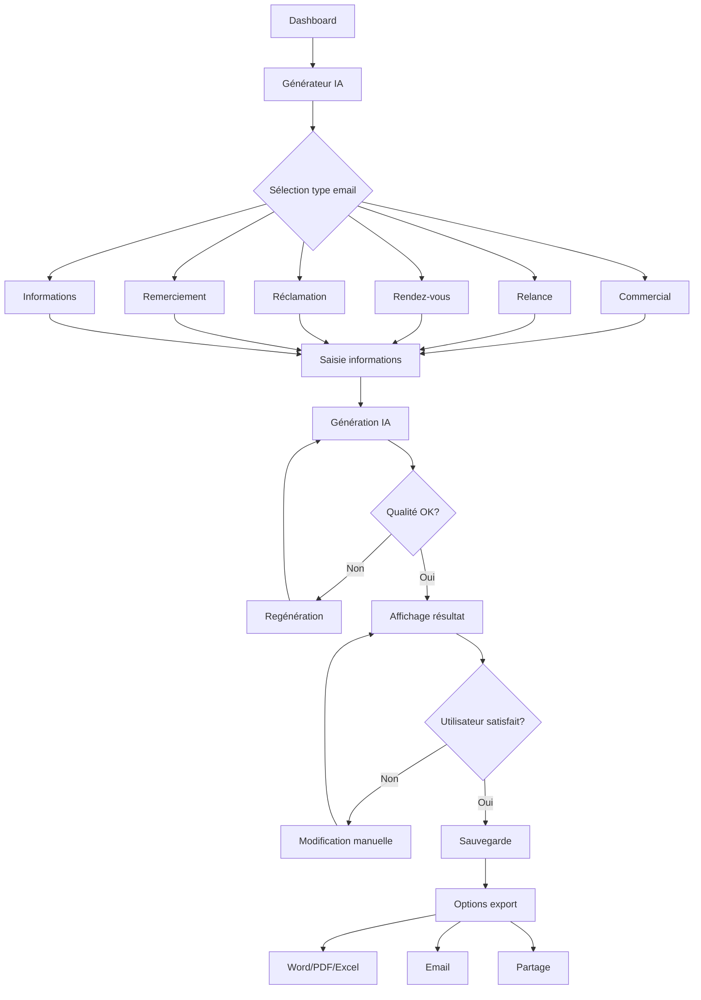
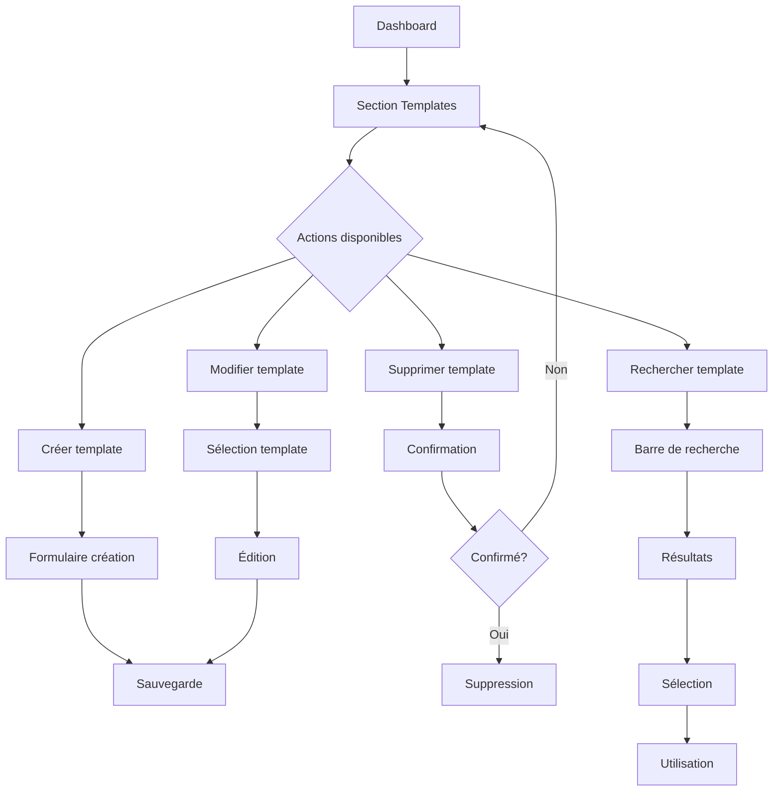
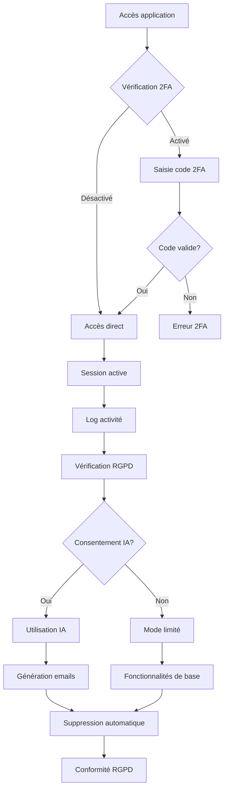
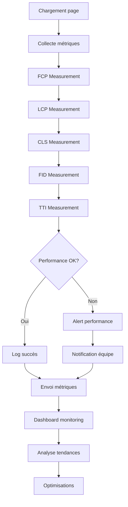
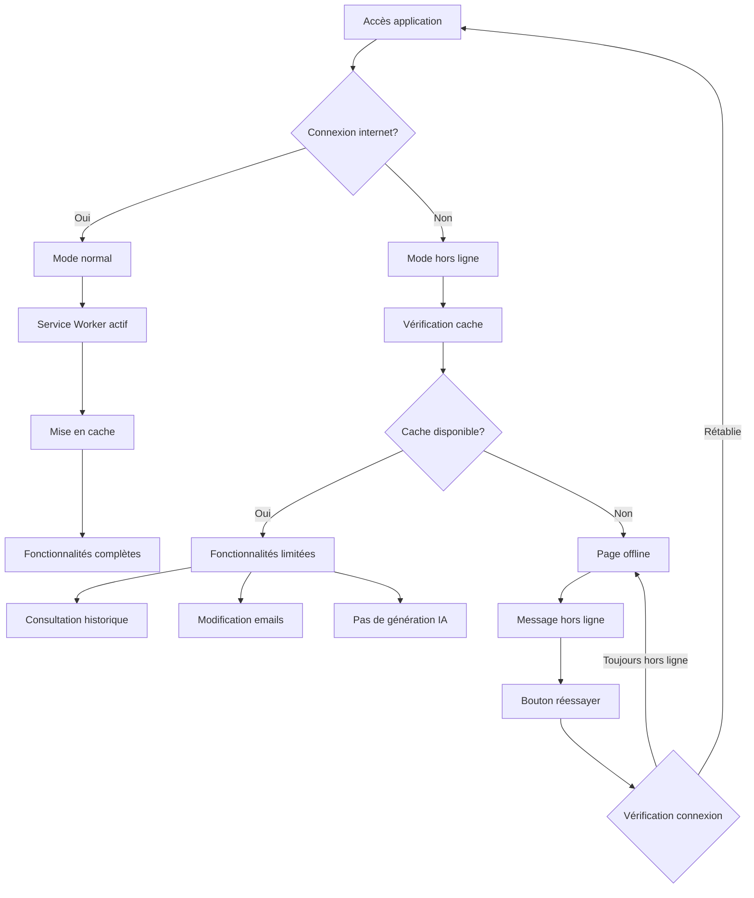
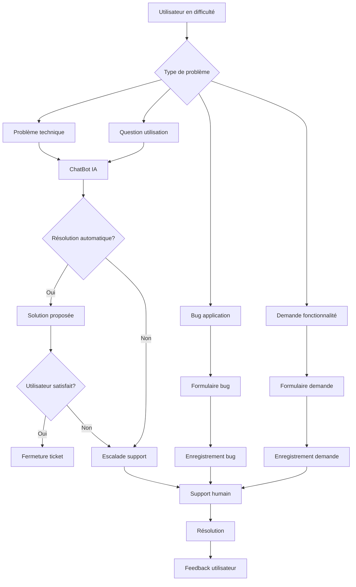
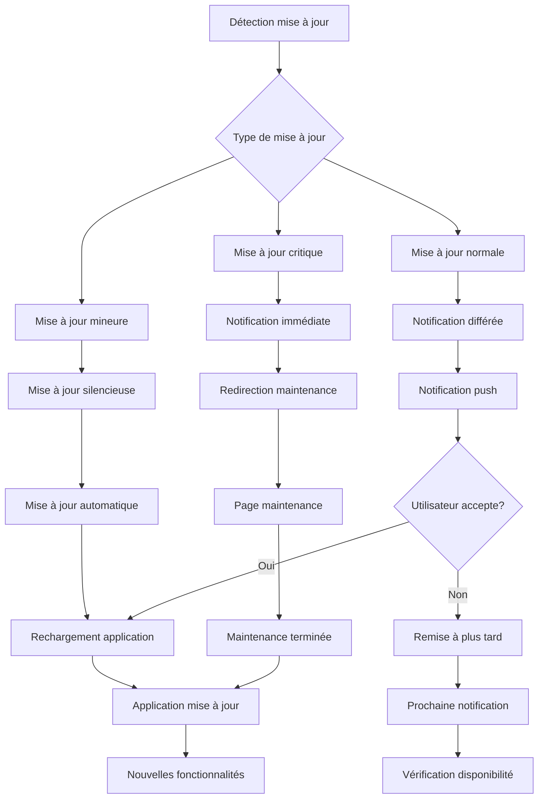

# Diagrammes de Flux Utilisateur - ProMail Assistant

## 1. Flux Principal Utilisateur



## 2. Flux d'Inscription et Onboarding



## 3. Flux de Génération d'Email



## 4. Flux de Gestion des Templates



## 5. Flux d'Export et Partage

```mermaid
flowchart TD
    A[Email généré] --> B[Options export]
    B --> C{Type d'export}
    
    C --> D[Word (.docx)]
    C --> E[PDF]
    C --> F[Excel (.xlsx)]
    C --> G[Email (.eml)]
    C --> H[Partage direct]
    
    D --> I[Téléchargement]
    E --> I
    F --> I
    G --> I
    
    H --> J{Plateforme}
    J --> K[Email]
    J --> L[Slack]
    J --> M[Teams]
    J --> N[WhatsApp]
    
    K --> O[Envoi email]
    L --> P[Message Slack]
    M --> Q[Message Teams]
    N --> R[Message WhatsApp]
```

## 6. Flux de Sécurité et RGPD



## 7. Flux de Performance et Monitoring



## 8. Flux PWA et Hors Ligne



## 9. Flux de Support et Aide



## 10. Flux de Mise à Jour et Maintenance

